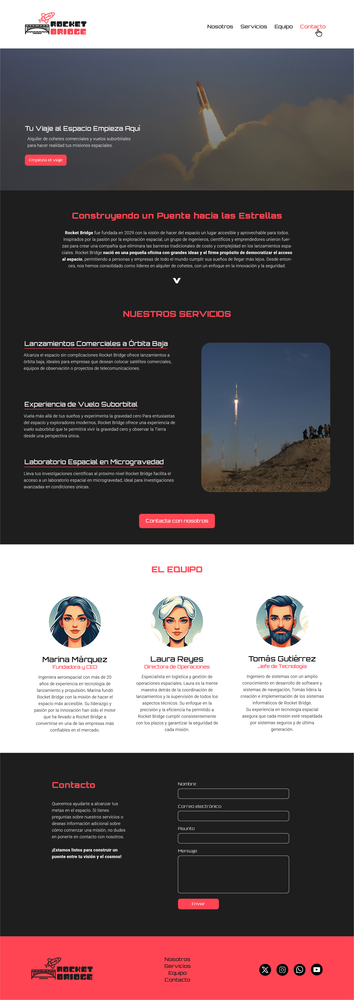
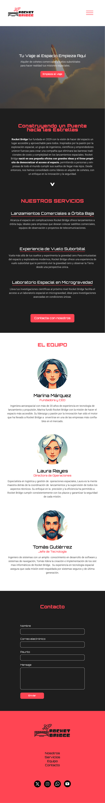

# Landing RocketBridge

¡Buenvenidos a RocketBridge, vuestra Landing Page para superar el bloque RampUp!

El ejercicio consiste en replicar el diseño de una imagen de referencia `Landing-Rocket.jpg`. Deberás utilizar HTML, CSS y aplicar media queries para adaptar el diseño a diferentes tamaños de pantalla. Esta es la referencia de versión mobile de este diseño: `Landing-Rocket-Mobile.jpg`.

## Instrucciones

1. Clona este repositorio en tu entorno de desarrollo:

   ```
   git clone (url del repo del ejercicio)
   ```

2. Crea un repositorio en tu cueta de GitHub para guardar este ejercicio.

3. Recuerda apuntar el proyecto clonado a ese nuevo repositorio creado:

   ```
   git remote set-url origin (url del repo creado en tu cuenta)
   ```

   Puedes comprobar si se ha realizado bien el cambio con este otro comando:

   ```
   git remote -v
   ```

4. Una vez hecho esto, en tu proyecto, crea el archivo `index.html` y una carpeta `/css` con la hoja de estilo dentro `style.css` en VSCode. Recurda vincular el CSS y el HTML. El archivo `index.html` será el punto de inicio para tu proyecto.

5. Crea el código necesario para replicar el diseño de la imagen de referencia proporcionada en la carpeta `img`. Asegúrate de que el diseño sea fiel a la imagen, incluyendo la estructura del sitio, los colores y las fuentes.

6. Las Fuentes usadas las podéis encontrar en GoogleFonts. Son las siguientes: 

    - Orbitron
    - Roboto

7. Encontraréis instrucciones sobre colores y estilos extra en esta imagen >>> `instrucciones-extra.jpg`

8. Asegúrate de que el diseño sea responsive >>> ver en imágenes la versión mobile >>> `Landing-Rocket-Mobile.jpg`

9. Cuando hayas completado el ejercicio, haz un add, un commit y un push de tus cambios al repositorio.
   ```
   git add .
   git commit -m "mensaje"
   git push
   ```

10. Envía la URL del respositorio con el ejercicio terminado en el Foro de la tarea en el campus con el mensaje `Ejercicio Terminado : Nombre Apellido`


## Imagen de Referencia

A continuación, puedes ver la imagen de referencia que debes replicar en tu diseño:



## Imagen de Referencia Versión Mobile

A continuación, puedes ver la imagen de referencia que debes replicar en tu diseño responsive:



## Recursos Adicionales

Puedes consultar la documentación de HTML y CSS para obtener ayuda adicional:

- [HTML MDN Web Docs](https://developer.mozilla.org/en-US/docs/Web/HTML)
- [CSS MDN Web Docs](https://developer.mozilla.org/en-US/docs/Web/CSS)